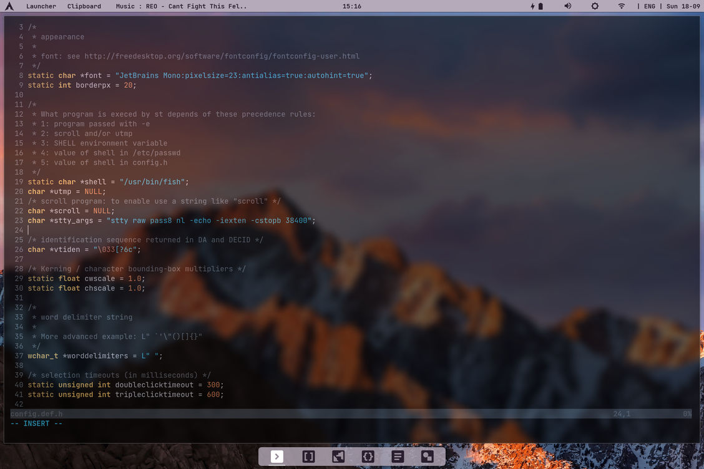
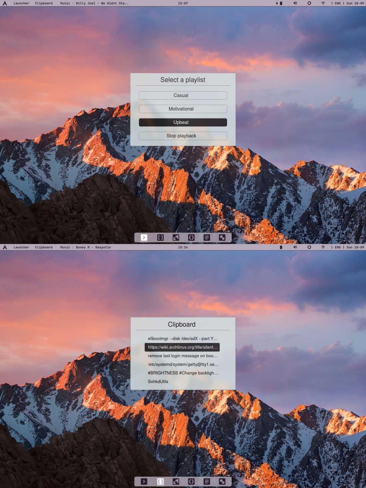
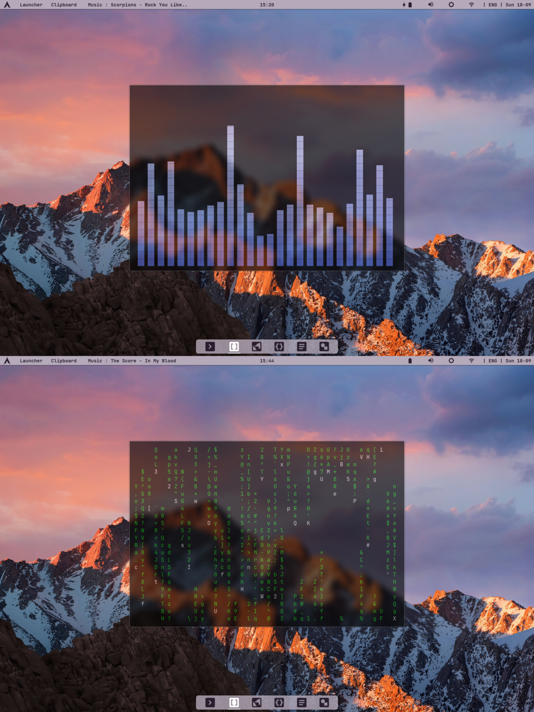

# Overview


- **Window Manager:** [bspwm](https://github.com/baskerville/bspwm)
- **Shell:** [fish](https://github.com/fish-shell/fish-shell)
- **Term:** [st](https://st.suckless.org)
- **Bar** [polybar](https://github.com/polybar/polybar)
- **Compositor** [picom](https://github.com/yshui/picom)
- **Editor** [neovim](https://github.com/neovim/neovim)
- **Application Launcher** [rofi](https://github.com/davatorium/rofi)
- **GTK Theme** [oranchelo](https://github.com/OrancheloTeam/oranchelo-icon-theme)
- **Notification Daemon** [dunst](https://github.com/dunst-project/dunst)
- **Music server** [mpd](https://github.com/MusicPlayerDaemon/MPD)

# Instalation
****this rice was made for framework laptop and may not work on other systems or resolutions (2256x1504)***
## Os
Install Arch with this guide: <a href=Arch-Install.md>Arch-Install.md<a/>

## Dotfiles
Clone this repo to home directory
```
git clone https://github.com/smravec/.dotfiles-bspwm ~/.dotfiles
```

## Dependencies
Install dependencies
```
yay -S xorg xorg-xinit xclip xcursor-breeze xcb-util-cursor unclutter oranchelo-icon-theme \
       bspwm sxhkd picom polybar \
       fish \
       ttf-material-desing-icons-webfont ttf-jetbrains-mono \
       pulseaudio pulse-bluetooth pulsemixer mpd mpc \
       rofi clipster dunst \
       firefox-developer-edition libreoffice vscodium-bin superproductivity-bin ocenaudio-bin krita vlc shotcut \
       discord signal-desktop \
       brightnessctl bluetoothctl scrot \
       cmatrix oneko cava pfetch feh colorpicker gtop pipes.sh tty-clock-git ranger libmagick \
       nodejs npm python python-pip \
       xf86-video-intel intel-media-driver 
```
```
pip install pypresence youtube-dl yt-dlp
```

## Personalization (optional)
copy your git token on set token "" (line 13, COPY TO CLIPBOARD section) into ""
```
vim ~/.dotfiles/config/sxhkd/SxhkdUtils 
```
pair bluetooth headphones with this guide - https://wiki.archlinux.org/title/bluetooth#Pairing <br/>
copy the id into clipboard (can look like: 04:CB:88:C8:1D:A4) <br/>
and paste it next to connect (leave one space between connect and id) (line 103, BLUETOOTH HEADPHONES section)  
```
vim ~/.dotfiles/config/sxhkd/SxhkdUtils 
```
create basic home dirs (if they dont exist already)
```
mkdir ~/Downloads \
      ~/Music ~/Videos \
      ~/Pictures ~/Pictures/Screenshots
```
create or copy existing .kbx file here and name it passwords.kbx
```
mv your-kbx-file.kbx ~/.dotfiles/config/fish/scripts/passwords.kbx
```
for easier easier touchpad on laptop navigation run
```
sudo mkdir -p /etc/X11/xorg.conf.d && sudo tee <<'EOF' /etc/X11/xorg.conf.d/90-touchpad.conf 1> /dev/null
Section "InputClass"
        Identifier "touchpad"
        MatchIsTouchpad "on"
        Driver "libinput"
        Option "Tapping" "on"
EndSection

EOF
```

## Final setup
copy all the dotfiles
```
cp -r ~/.dotfiles/config/* ~/.config/
cp -r ~/.dotfiles/home-dir/* ~/
```
refresh font cache
```
fc-cache -fv
```

## Term
compile st
```
cd ~/.dotfiles/st
sudo make install
```

## Neovim
setup neovim
```
nvim
:PlugInstall
```

# Keybinds

## Wm and Other Keybinds

|    Keybind      |             Command                  |
|:---------------:|:------------------------------------:|
|   super + Enter |              Term                    |
|   super + r     |             Launcher                 |
|   super + c     |            Clipboard                 |
|   super + m     |              Music                   |
| super + {a,s,d} | Floating, Tiled or Fullscreen state  |
|   super + q     |          Close Window                |
|super + Shift + r|           Quit Bspwm                 |
|   super + f     |           Change focus               |
|   super + b     |       Connect to headphones          |
|   super + g     |          Copy git token              |
|   super + m     |         Select playlist              |
|   super + n     |    Show last Dunst notification      |

****super = Windows Key***

## St Keybinds

| Keybind|   Command |
|:------:|:---------:|
|ctrl + z|   Zoom    |
|ctrl + x|  Unzoom   |
|ctrl + o| Scroll up |
|ctrl + p|Scroll down|

## Custom Aliases
**mdownload** - download media from youtube <br/>
**dmount** - mount device as user (editable without sudo) <br/>
**passwords** - open password database with kpcli 

# Gallery
<div align="center" >





<div/>
